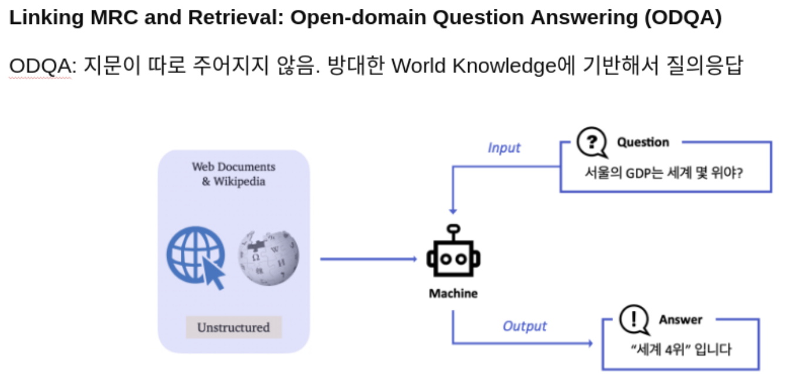
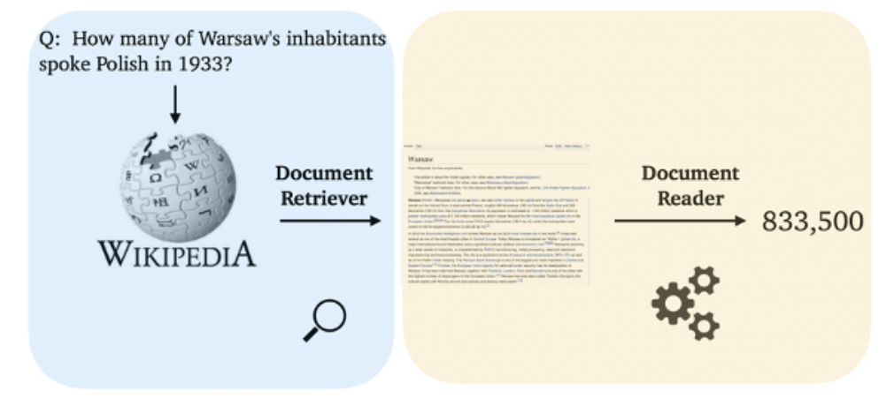
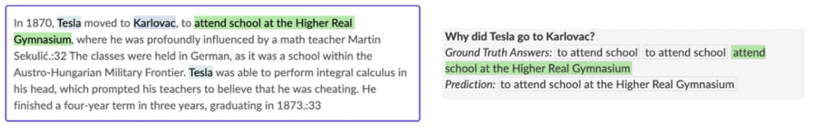
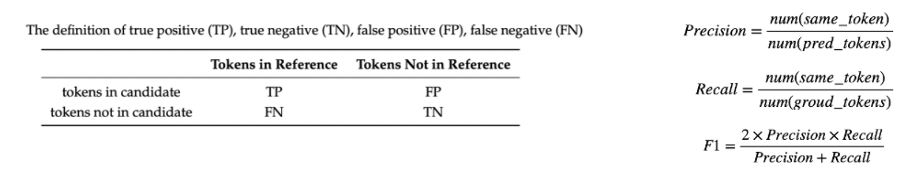
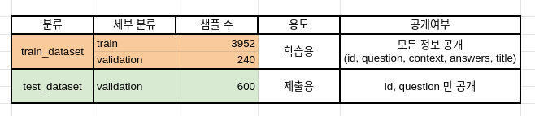

# [NLP] Open-Domain Question Answering

## **"서울의 GDP는 세계 몇 위야?", "MRC가 뭐야?"**

우리는 궁금한 것들이 생겼을 때, 아주 당연하게 검색엔진을 활용하여 검색을 합니다. 이런 검색엔진은 최근 MRC (기계독해) 기술을 활용하며 매일 발전하고 있는데요. 본 대회에서는 우리가 당연하게 활용하던 검색엔진, 그것과 유사한 형태의 시스템을 만들어 볼 것입니다.

**Question Answering (QA)은 다양한 종류의 질문에 대해 대답하는 인공지능**을 만드는 연구 분야입니다.다양한 QA 시스템 중, **Open-Domain Question Answering (ODQA) 은 주어지는 지문이 따로 존재하지 않고 사전에 구축되어있는 Knowledge resource 에서 질문에 대답할 수 있는 문서를 찾는** 과정이 추가되기 때문에 더 어려운 문제입니다.



본 ODQA 대회에서 우리가 만들 모델은 two-stage로 구성되어 있습니다. 첫 단계는 질문에 관련된 문서를 찾아주는 "retriever" 단계이고, 다음으로는 관련된 문서를 읽고 적절한 답변을 찾거나 만들어주는 "reader" 단계입니다. 두 가지 단계를 각각 구성하고 그것들을 적절히 통합하게 되면, 어려운 질문을 던져도 답변을 해주는 ODQA 시스템을 여러분들 손으로 직접 만들어보게 됩니다.

따라서, 대회는 더 정확한 답변을 내주는 모델을 만드는 팀이 좋은 성적을 거두게 됩니다.



## 평가 방법
두 가지 평가지표를 사용합니다.

1. **Exact Match (EM)**: 모델의 예측과, 실제 답이 정확하게 일치할 때만 점수가 주어집니다. 즉 모든 질문은 0점 아니면 1점으로 처리됩니다. 단, 띄어쓰기나 "."과 같은 문자가 포함되어 있다고 오답으로 처리되면 억울하겠죠? 이런 것은 제외한 후 정답에 대해서만 일치하는지 확인합니다. 또한 답이 하나가 아닐 수 있는데, 이런 경우는 하나라도 일치하면 정답으로 간주합니다.



2. **F1 Score**: EM과 다르게 부분 점수를 제공합니다. 예를 들어, 정답은 "Barack Obama"지만 예측이 "Obama"일 때, EM의 경우 0점을 받겠지만 F1 Score는 겹치는 단어도 있는 것을 고려해 부분 점수를 받을 수 있습니다.



**EM 기준으로 리더보드 등수가 반영**되고, F1은 참고용으로만 활용됩니다.

## 설치 방법

### 요구 사항

```
# 필요한 파이썬 패키지 설치. 
bash ./install/install_requirements.sh
```

## 파일 구성


### 저장소 구조


- ./install/: 요구사항 설치 파일
- retrieval.py: 여러 retreiver 모듈 로드
- arguments.py: 실행되는 모든 argument 가 dataclass 의 형태로 저장되어있음
- trainer_qa.py: MRC 모델 학습에 필요한 trainer 제공
- utils_qa.py: 기타 유틸 함수 제공
- train.py: MRC, Retrieval 모델 학습 및 평가
- inference.py: ODQA 모델 평가 또는 제출 파일 (predictions.json) 생성
- get_preprocessing_dataset_for_ict.py: Inverse Cloze Task를 수행하기 위한 데이터셋 생성
- context_merge.py: 하나의 query와 k개의 context를 합친 입력을 넣은 학습
- ./ipynb/elastic_search.ipynb: Elastis Search를 사용하기 위해 먼저 실행, 데이터 인덱싱
- ./ipynb/create_qg_data_v1.ipynb: 위키 데이터를 이용한 question generation
- ./ipynb/create_fold_dataset.ipynb: k-fold validation을 위한 분리 데이터 생성
- ./ipynb/EDA_data_processing.ipynb: EDA와 전처리 데이터셋 생성
- ./ipynb/EDA_overview.ipynb: 기본적인 EDA
- ./ipynb/EDA_mrc_trainset.ipynb: train 데이터셋에 대한 EDA
- ./ipynb/EDA_mrc_validationset.ipynb: validation 데이터셋에 대한 EDA
- ./ipynb/EDA_retrieval_dataset.ipynb: wikipedia_documents.json 데이터셋에 대한 EDA
- ./readers/longformer.py: Longformer 모델 생성
- ./retrievers/sparse.py: sparse retriever 모듈 제공
- ./retrievers/DenseRetrieval.py: dense retriever 모듈 제공
- ./retrievers/elastic_search.py: elastic search 모듈 제공
- ./retrievers/DenseAndElasticRetrieval.py: dense retriever 와 elastic search 혼합 사용 모듈 제공
## 데이터 소개

아래는 제공하는 데이터셋의 분포를 보여줍니다.



데이터셋은 편의성을 위해 Huggingface 에서 제공하는 datasets를 이용하여 pyarrow 형식의 데이터로 저장되어있습니다. 다음은 데이터셋의 구성입니다.

```python
./data/                        # 전체 데이터
    ./train_dataset/           # 학습에 사용할 데이터셋. train 과 validation 으로 구성 
    ./test_dataset/            # 제출에 사용될 데이터셋. validation 으로 구성 
    ./wikipedia_documents.json # 위키피디아 문서 집합. retrieval을 위해 쓰이는 corpus.
```

data에 대한 argument 는 `arguments.py` 의 `DataTrainingArguments` 에서 확인 가능합니다. 

# 훈련, 평가, 추론

## train

만약 arguments 에 대한 세팅을 직접하고 싶다면 `arguments.py` 를 참고해주세요. 

roberta 모델을 사용할 경우 `--is_roberta` 를 추가로 입력합니다.

```
# 학습 예시 (train_dataset 사용)
python train.py --output_dir ./models/train_dataset --model_name_or_path klue/roberta-large --is_roberta --do_train
```

## eval

MRC 모델의 평가는(`--do_eval`) 따로 설정해야 합니다.  위 학습 예시에 단순히 `--do_eval` 을 추가로 입력해서 훈련 및 평가를 동시에 진행할 수도 있습니다.

```
# mrc 모델 평가 (train_dataset 사용)
python train.py --output_dir ./outputs/train_dataset --model_name_or_path ./models/train_dataset/ --do_eval 또는
python train.py --output_dir ./outputs/train_dataset --model_name_or_path klue/roberta-large --is_roberta --do_train --do_eval
```

## retrieval

Retriever 모델의 평가는 `--do_retrieval_example` 로 기존에 있던 retrieval 예시 코드를 실행할 수도 있습니다.
```
# retriever 모델 평가
python retrieval.py --output_dir ./ --do_eval --retrieval_model ElasticSearch

```

## inference

retrieval 과 mrc 모델의 학습이 완료되면 `inference.py` 를 이용해 odqa 를 진행할 수 있습니다.

* 학습한 모델의  test_dataset에 대한 결과를 제출하기 위해선 추론(`--do_predict`)만 진행하면 됩니다. 

* 학습한 모델이 train_dataset 대해서 ODQA 성능이 어떻게 나오는지 알고 싶다면 평가(`--do_eval`)를 진행하면 됩니다.

```
# ODQA 실행 (test_dataset 사용)
# wandb 가 로그인 되어있다면 자동으로 결과가 wandb 에 저장됩니다. 아니면 단순히 출력됩니다
python inference.py --output_dir ./outputs/test_dataset/ --dataset_name ../data/test_dataset/ --model_name_or_path ./models/train_dataset/ --retrieval_model ElasticSearch --do_predict
```

## How to submit

`inference.py` 파일을 위 예시처럼 `--do_predict` 으로 실행하면 `--output_dir` 위치에 `predictions.json` 이라는 파일이 생성됩니다. 해당 파일을 제출해주시면 됩니다.

## Things to know

1. `train.py` 에서 sparse embedding 을 훈련하고 저장하는 과정은 시간이 오래 걸리지 않아 따로 argument 의 default 가 True로 설정되어 있습니다. 실행 후 sparse_embedding.bin 과 tfidfv.bin 이 저장이 됩니다. **만약 sparse retrieval 관련 코드를 수정한다면, 꼭 두 파일을 지우고 다시 실행해주세요!** 안그러면 존재하는 파일이 load 됩니다.
2. 모델의 경우 `--overwrite_cache` 를 추가하지 않으면 같은 폴더에 저장되지 않습니다. 

3. ./outputs/ 폴더 또한 `--overwrite_output_dir` 을 추가하지 않으면 같은 폴더에 저장되지 않습니다.
